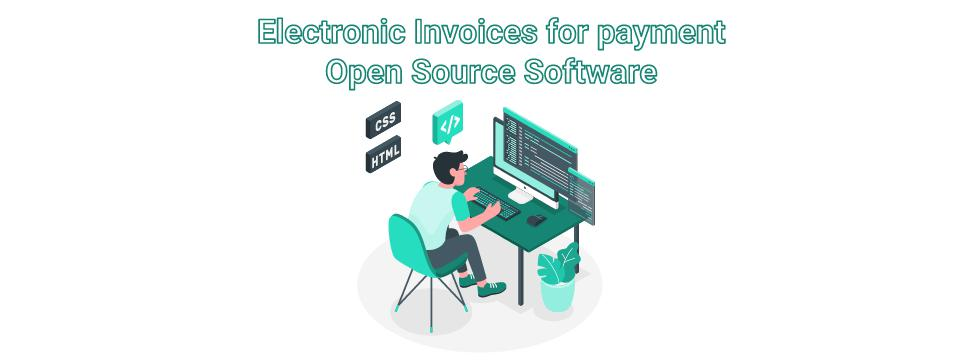

<!-- ### Hi there 👋

**open-e-cont-md/open-e-cont-md** is a ✨ _special_ ✨ repository because its `README.md` (this file) appears on your GitHub profile.

Here are some ideas to get you started:

- 🔭 I’m currently working on ...
- 🌱 I’m currently learning ...
- 👯 I’m looking to collaborate on ...
- 🤔 I’m looking for help with ...
- 💬 Ask me about ...
- 📫 How to reach me: ...
- 😄 Pronouns: ...
- ⚡ Fun fact: ...
--> 

<h2 center>An open-code e-Invoicing solution for B2G, B2B and B2C sectors.</h2>
<h3>e-Invoicing is a digital solution that enables public sector and business (companies) to receive and process electronic invoices.</h3>
<h3>API(s) for intergration</h3>
<h3>Open source software (OSS) is software that is distributed under a OSS license with its source code, making it available for use, modification, and distribution</h3>

<h3>Community</h3>

We invite everyone to participate in the e-Cont.md Community, where you can learn from other’s past mistakes. If you can’t find your particular problem addressed there, you can always ask a question!
	 We’re the best open-source billing and payments platform available and plan to stay that way.
	 Our efforts rely on your patronage to continuously maintain and evolve e-Cont.md.

<strong>Ask the Community
	</strong> For questions, please refer to:
	 - our blog
	 - our community

<h3>Developer and Consulting Support</h3>

Just getting started with e-Cont.md?
	 Do you need help to tackle a specific issue or roadblock?
	 We can help through consulting. We can also explore s-Cont.md potential to fulfill your requirements by reviewing them and providing an assessment.
	 Consulting is available in four-hour blocks via a dedicated, private Slack channel with the open.e-Cont.md core team.
	 Each four-hour block is eur800.

Sign up for support

<h3>Sponsorship</h3>

Check out our sponsorship opportunities.
	 If your company is using e-Cont.md, consider becoming a Sponsor. 
	 The Platinum Sponsor tier gives you a dedicated, private Slack channel with the e-Cont.mdd core team. 
	 A peace of mind that you can reach someone when you need it.

This is not an Enterprise-level support agreement and does not grant a service level agreement.

Become a Sponsor

Sign up for support

